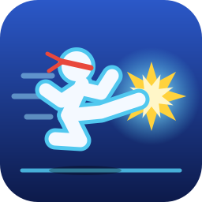

<p align="center"></p>

# OpenLF2

OpenLF2 is a playable, open-source reimplementation of **Little Fighter 2 v2.0a**.
It recreates the original’s fast, side-view fighting gameplay and supports mods.

## What you can play

- Versus, Stage, Battle, Championship, Team Championship, and Demo modes
- Keyboard and controller play, with touch controls on supported screens
- Music, recordings, and replays (compatible)
- Network matches between OpenLF2 players

The game is still being developed. Some behavior and platform builds have not yet been
verified against the original game or on real devices.

## Beyond the original

- Keyboard, controller, and touch navigation on every menu — the original's launch
  screens are mouse-only
- An on-screen gamepad for touch devices
- An options page: upscaling filter (including an xBRZ-style shader), fullscreen toggle,
  FPS counter, controller/phone rumble, and an "unlock hidden characters" switch

## Getting started

Try the [WebAssembly build in your browser](https://openlf2.github.io/OpenLF2/) — no install
needed beyond your own copy of the installer, see below.

OpenLF2 needs the **Little Fighter 2 v2.0a installer** to load the original game data.
The installer is not included. Provide your own copy when prompted; OpenLF2 reads its
resources without installing or extracting the game.

### Build from source

Requirements: CMake 3.25+, Ninja, a C++23 compiler, and development packages for SDL3,
LuaJIT, zlib, bzip2, OpenSSL, FFmpeg, and libcurl.

```sh
cmake --preset debug
cmake --build --preset debug
build/debug/openlf2 --installer path/to/LF2_v2.0a.exe
```

Useful flags: `--config-dir DIR` (settings/data location), `--mod PATH` (load a mod),
`--headless` (no window), `--scripts DIR` (run from source scripts instead of the copy
beside the executable).

## Network play

Network matches connect OpenLF2 players to other OpenLF2 players; compatibility with
original LF2 is not supported. Choose **Network Game** in the launch screen to host or join.
The default port is TCP 12345.

## Architecture

C++ owns engine mechanisms — state storage, rendering, audio, resource loading,
networking — behind small project-owned interfaces; platform libraries (SDL3, LuaJIT,
FFmpeg, libcurl) stay behind adapters. Lua owns gameplay and UI policy: combat rules, AI,
modes, menus, and HUD. The base game and mods share the same versioned script API.

## Modding

Mods are packages under `mods/`, declared with a `package.manifest` (id, version, required
API version, dependencies) that can add a module, extend a base module with a decorator,
replace it outright, or mount extra asset files. See
[`mods/example-character`](mods/example-character/README.md) for a working example, and
the [contribution guide](CONTRIBUTING.md) for how to propose engine changes.

## License

OpenLF2's code, scripts, and documentation are MIT-licensed ([LICENSE](LICENSE)). This
license does not cover the original game, its executable, or its assets.

## The original game

Little Fighter 2 was created by Marti Wong and Starsky Wong. Visit the
[original Little Fighter 2 website](https://www.lf2.net/en/intro.html). Support them with the
[Little Fighter 2 Remastered by Marti Wong](https://www.lf2.net/) or on its
[Steam page](https://store.steampowered.com/app/3249650/).

## Trademarks

Little Fighter 2, Nintendo Switch, PlayStation Vita, Windows, Android, macOS, and iOS
are names or marks of their respective rights holders. They are used here only to identify
the game or platforms. OpenLF2 is an independent project and is not affiliated with or
endorsed by those rights holders.
